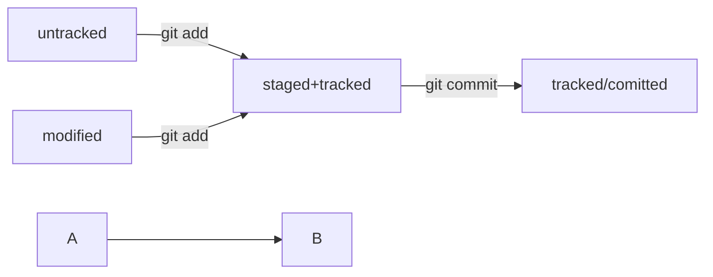

# Навигация по коммитам. Статусы файлов.
## Хеш — идентификатор коммита.

В этом уроке разберём, что такое хеши и зачем они нужны.

### Что такое хеш. Хеширование коммитов

**Хеширование** (от англ. *hash*, «рубить», «крошить», «мешанина») — это способ 
преобразовать набор данных и получить их «отпечаток» (англ. *fingerprint*).

Отлично! Теперь вы знаете, что такое хеш коммита и для чего он нужен. Подведём итоги: 
- Git преобразует информацию о коммитах с помощью алгоритма SHA-1 и  
для каждого из них рассчитывает уникальный идентификатор — хеш.
- Хеш — основной идентификатор коммита и позволяет узнать его автора, 
дату и содержимое закоммиченных файлов.
- Все хеши, а также таблицу соответствий *bash хеш → информация о коммите* Git 
хранит в папке .git.

